# Veille-Informatique

Bot discord pour centraliser les FluxRSS

## Sommaire

* #### [Intro](https://github.com/AetherBlack/Veille-Informatique#user-content-intro-1)
* #### [Téléchargement](https://github.com/AetherBlack/Veille-Informatique#user-content-téléchargement-1)
* #### [Installation des libs](https://github.com/AetherBlack/Veille-Informatique#user-content-installation-des-libs-1)
* #### [Création du bot](https://github.com/AetherBlack/Veille-Informatique#user-content-création-du-bot-1)
* #### [Lancement du bot](https://github.com/AetherBlack/Veille-Informatique#user-content-lancement-du-bot-1)
* #### [Flux RSS](https://github.com/AetherBlack/Veille-Informatique#user-content-flux-rss-1)
* #### [Finalisation](https://github.com/AetherBlack/Veille-Informatique#user-content-finalisation-1)
* #### [Bonus - Changement du temps entre deux vérifications](https://github.com/AetherBlack/Veille-Informatique#user-content-bonus---changement-du-temps-entre-deux-vérifications-1)

## Intro

Ce bot a pour but de centraliser les informations contenues dans les fluxrss.

J'ai personnellement utilisé ce bot pour ma Veille Informatique de BTS SIO ainsi que pour celle de ma licence SYSOPS.

## Téléchargement

* Linux

```
git clone https://github.com/AetherBlack/Veille-Informatique
```

* Windows

Vous pouvez télécharger le fichier zip sur [ce lien](https://github.com/AetherBlack/Veille-Informatique/archive/master.zip).

## Installation des libs

* Linux

```
pip3 install -r requirements.txt
```

* Windows

```
pip3 install -r requirements.txt
```

OU

```
LECTEUR:\PATH\TO\Python3\Scripts\pip3.exe install -r LECTEUR:\PATH\TO\PROJECT\requirements.txt
```

## Création du bot

Rendez-vous sur le site web developer de discord : <https://discordapp.com/developers/applications>

Connectez-vous avec votre compte ou créez en un.

Créez ensuite une application. 


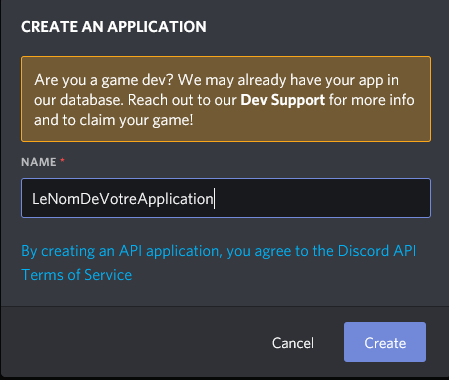

Puis rendez-vous dans la section `SETTINGS>BOT` sur le panneau de gauche.

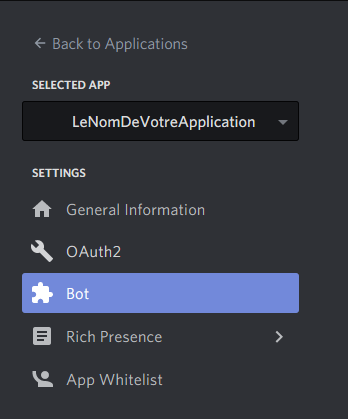

Cliquez ensuite sur `Add Bot` > `Yes, do it!`. Votre bot est créé.


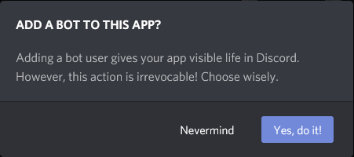

Il faut maintenant créer le serveur. Depuis l'application discord sur le panneau de gauche : `Add a server` > `Create a server` > `Nom de votre serveur` > `Create`. Au passage créez un channel spécifique si vous en avez besoin.


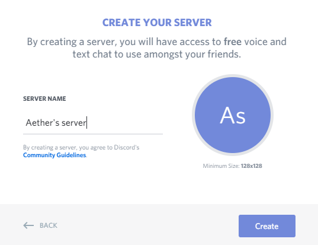

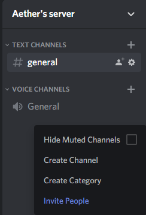

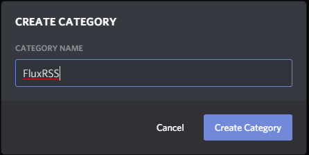

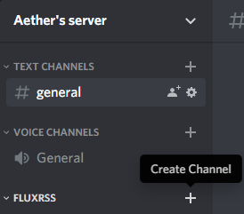


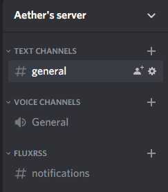

Lancez ensuite le lien suivant en remplacement `YOUR_CLIENT_ID_HERE` dans votre URL par votre `CLIENT ID` qui se situe sur la page developer de discord toujours sur la partie gauche `SETTINGS>General Information` : <https://discordapp.com/oauth2/authorize?client_id=YOUR_CLIENT_ID_HERE&scope=bot&permissions=536083519>

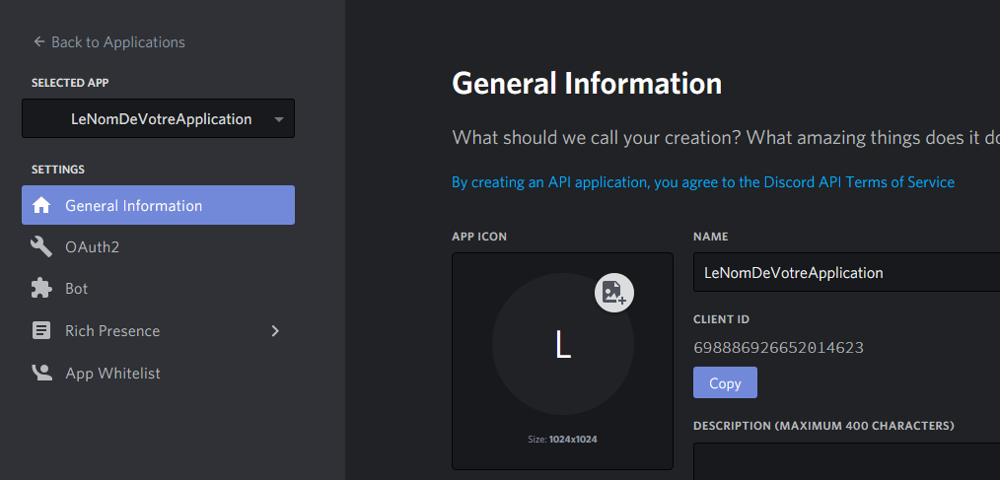


Le site va alors vous demander de vous authentifiez. Si vous êtes déjà authentifié avec votre compte, alors sélectionné votre serveur dans la liste déroulante `ADD BOT TO:` puis `Continue`. Laissez lui tous les droits et enfin faites `Authorize`. Validez le captcha et votre bot sera sur votre serveur.

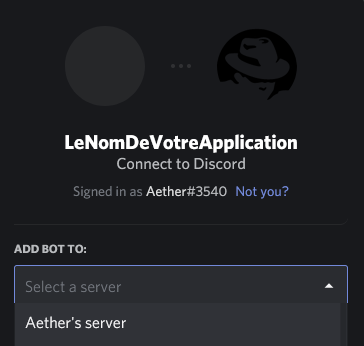

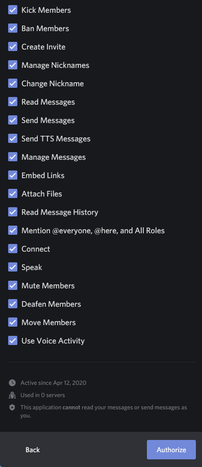

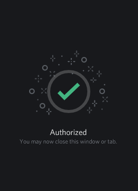

## Lancement du bot

Pour que le bot fonctionne il va falloir modifier deux valeurs.

Premièrement depuis la section `SETTINGS>BOT` sur le portail developers de discord récupéré le TOKEN de votre bot.

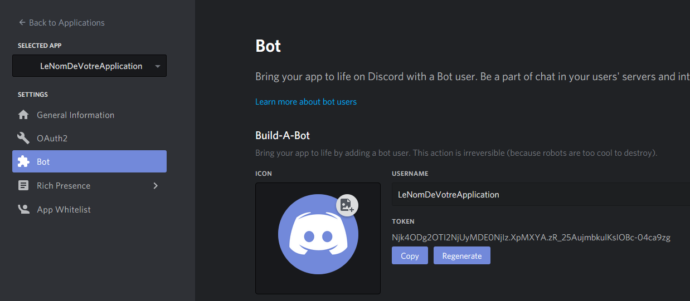

Une fois celui-ci copié, collé-le dans le fichier `const/__init__.py` à la place de `YOUR_BOT_TOKEN`.

```python
#Token
TOKEN = "YOUR_BOT_TOKEN" #<= ICI
#TOKEN = "Njk4ODg2OTI2NjUyMDE0NjIz.XpMXYA.zR_25AujmbkulKsIOBc-04ca9zg"
```

Ensuite, il va falloir récupérer l'ID du channel pour que le bot envoie les notifications sur celui-ci.

Lancez le fichier `get_channel.py` avec la commande suivante:

```python
python3 get_channel.py
```

Dans mon cas, j'ai une catégorie nommé `FluxRSS` et un channel nommé `notifications`. Je vais donc récupérer l'ID du channel `notifications`.

Après l'exécution du script. Vous devriez avoir une liste de channel ainsi que leur ID correspondant.

*Les ID ci-dessous sont à titre d'exemple*
```
Logged in as Veille Informatique
111111111111111111
------------------
Flux RSS 222222222222222222
notifications 333333333333333333
```

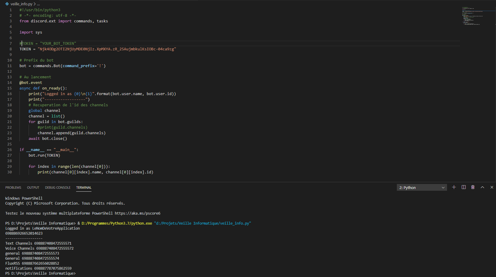

Récupérez l'id de votre channel et collé le à nouveau dans le fichier `const/__init__.py` à la place de la variable "CHANNEL_RSS" :

```python
#CHANNEL FLUX RSS -> NOTIF ID
CHANNEL_RSS = INT_CHANNEL # <= ICI
#CHANNEL_RSS = 698887787075862559
```

## Flux RSS

Maintenant que votre bot est quasi fonctionnement, il ne vous reste plus qu'à mettre vos lien de fluxrss dans la variable FLUX_RSS toujours dans le fichier `const/__init__.py` :

*Les liens ci-dessous sont des fluxrss de Google Alertes pour le WPA-3 à titre d'exemple*
```python
#Flux RSS
FLUX_RSS = ["https://www.google.com/alerts/feeds/10044275366631447452/1055738863244347746",
            "https://www.google.com/alerts/feeds/10044275366631447452/5208661666063475899",
            "https://www.google.fr/alerts/feeds/10044275366631447452/3528165564465536219",
            "https://www.google.fr/alerts/feeds/10044275366631447452/9042324707641309434"]
```

Remplacez les valeurs actuellements définis par les vôtres.

```python
FLUX_RSS = ["REPLACE_WITH_RSS_LINK",
            "https://www.google.com/alerts/feeds/10044275366631447452/5208661666063475899"]#<= Exemple de FluxRSS avec Google Alertes
```

## Finalisation

Une fois cela fait il ne reste plus qu'à lancer votre bot discord.

```bash
$ python3 main.py

Logged in as Veille Informatique
686300298574168078
------------------
```

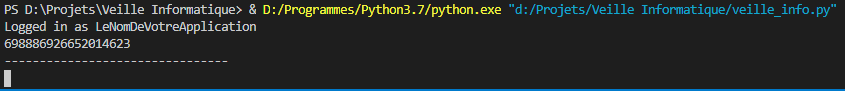

Vous pouvez le laisser tourné h24 sur un raspberry ou alors le lancer quand cela vous chantes. Libre à vous.

Sous Linux vous pouvez mettre l'éxécution du script en tâche de fond grâce à la commande `nohup` ainsi que le caractère "&" à la fin de votre commande :

```bash
$ nohup python3 main.py &

Logged in as Veille Informatique
686300298574168078
------------------
```

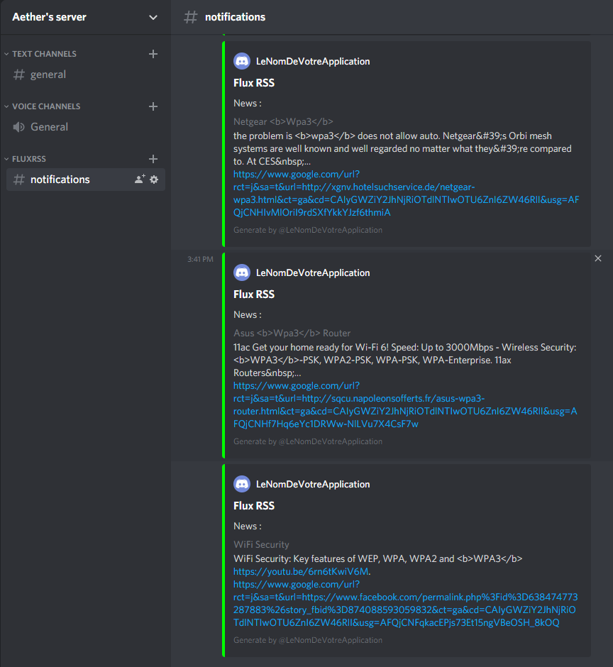

## Bonus - Changement du temps entre deux vérifications

Le bot vérifie par défaut toutes les heures s'il y a des nouvelles news dans les feedrss.

Pour changer cette valeur, modifier la variable `WAIT_NEW_NEWS` dans le fichier `const/__init__.py`

```python
WAIT_NEW_NEWS = 60 * 60#Each hours
```

Vous pouvez ouvrir un ticket, si vous avez des questions ou que vous rencontrez des problèmes.
